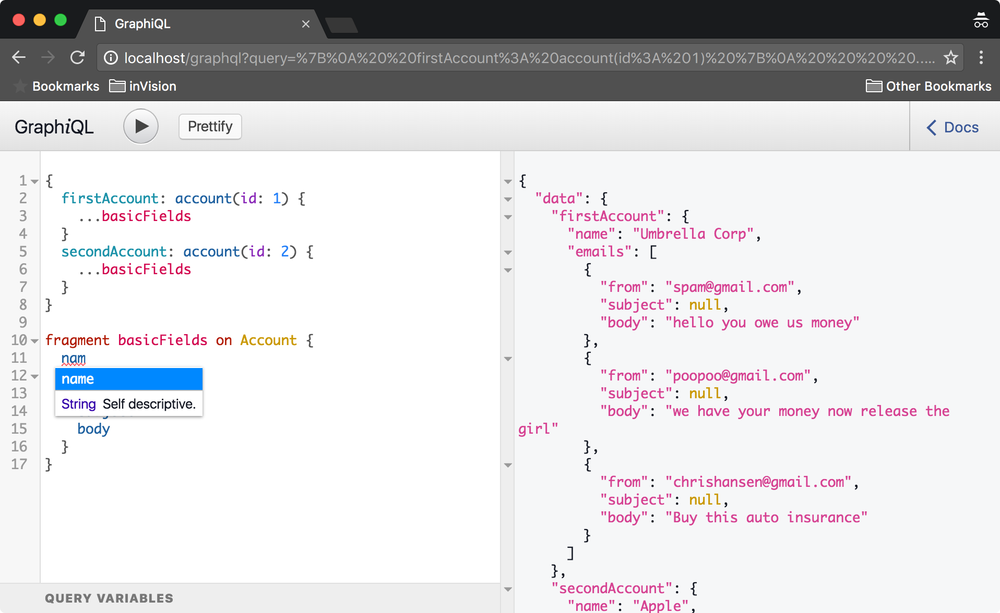

# GraphQL Experiment

<!-- START doctoc generated TOC please keep comment here to allow auto update -->
<!-- DON'T EDIT THIS SECTION, INSTEAD RE-RUN doctoc TO UPDATE -->
**Table of Contents**  *generated with [DocToc](https://github.com/thlorenz/doctoc)*

- [How to use this project](#how-to-use-this-project)
- [Example Queries](#example-queries)
  - [Simple Query](#simple-query)
  - [Aliases](#aliases)
  - [Fragments](#fragments)
  - [GraphiQL Web Explorer](#graphiql-web-explorer)

<!-- END doctoc generated TOC please keep comment here to allow auto update -->

## How to use this project
1. `docker-compose up` to start the API service, the MySQL server, and the migrations container (seeds MySQL schema + data)
2. To access GraphiQL, navigate web browser to http://localhost/graphiql (assuming use of docker native, adjust host if using legacy docker)

## Example Queries

### Simple Query
```js
# Query
{
  accounts (id: 1) {
    name
    emails {
      from
      subjet
      body
    }
  }
}

# Response
{
  "data": {
    "accounts": {
      "name": "Umbrella Corp",
      "emails": [
        {
          "from": "spam@gmail.com",
          "subject": null,
          "body": "hello you owe us money"
        },
        {
          "from": "poopoo@gmail.com",
          "subject": null,
          "body": "we have your money now release the girl"
        },
        {
          "from": "chrishansen@gmail.com",
          "subject": null,
          "body": "Buy this auto insurance"
        }
      ]
    }
  }
}
```

### Aliases
Using aliases we can request two different account objects and have the "aliased" to separate
properties on the response object.
```js
# Query
{
  firstAccount: account(id: 1) {
    name
    emails {
      from
      subject
      body
    }
  }
  secondAccount: account(id: 2) {
    name
    emails {
      from
      subject
      body
    }
  }
}

# Response
{
  "data": {
    "firstAccount": {
      "name": "Umbrella Corp",
      "emails": [
        {
          "from": "spam@gmail.com",
          "subject": null,
          "body": "hello you owe us money"
        },
        {
          "from": "poopoo@gmail.com",
          "subject": null,
          "body": "we have your money now release the girl"
        },
        {
          "from": "chrishansen@gmail.com",
          "subject": null,
          "body": "Buy this auto insurance"
        }
      ]
    },
    "secondAccount": {
      "name": "Apple",
      "emails": [
        {
          "from": "chrishansen@gmail.com",
          "subject": null,
          "body": "Why don't you have a seat."
        }
      ]
    }
  }
}
```

### Fragments
In the aliases example, the query is not very DRY. The requested fields are repeated for both accounts.
We can improve this with fragments
```js
# Query
{
  firstAccount: account(id: 1) {
    ...basicFields
  }
  secondAccount: account(id: 2) {
    ...basicFields
  }
}

fragment basicFields on Account {
  name
  emails {
    from
    subject
    body
  }
}

# Response same as in Alias example
```

### GraphiQL Web Explorer
Since the schema for our graphql service is defined, we get documentation and tools for free. One tool is `GraphiQL` - 
a web based service inspection tool that loads when the graphql endpoint is loaded in a web browser.
